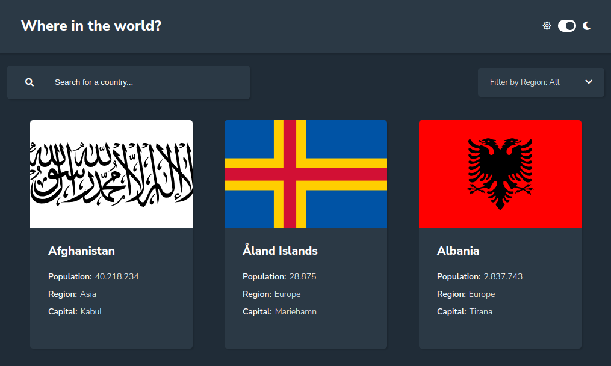
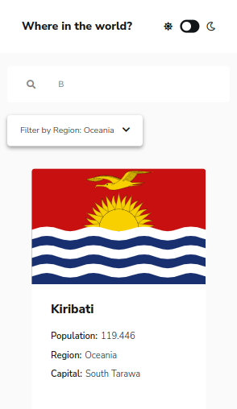
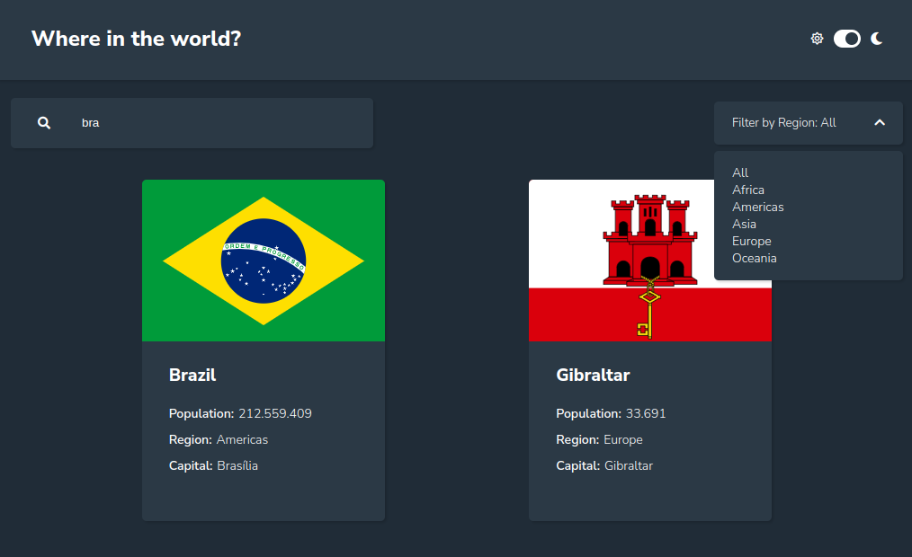
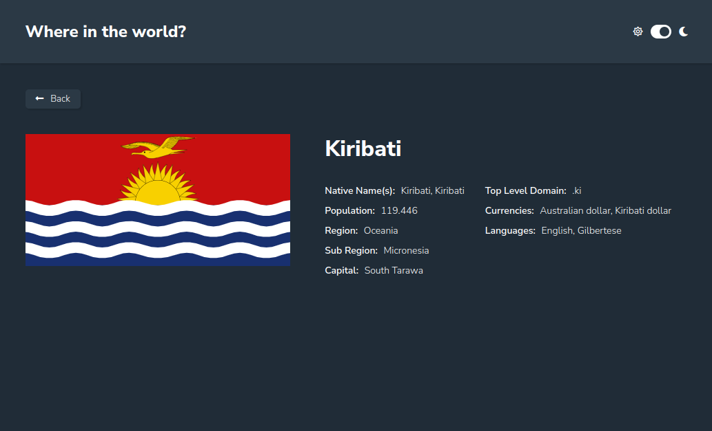
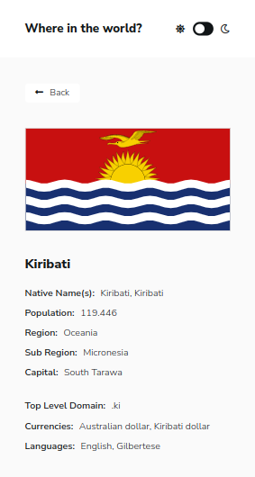

# REST Countries API with color theme switcher solution

This is my solution to the [REST Countries API with color theme switcher challenge on Frontend Mentor](https://www.frontendmentor.io/challenges/rest-countries-api-with-color-theme-switcher-5cacc469fec04111f7b848ca).

## Table of contents

- [Overview](#overview)
  - [The project](#the-project)
  - [Links](#links)
- [My process](#my-process)
  - [Built with](#built-with)
  - [What I learned](#what-i-learned)
- [Author](#author)

## Overview

### The project

Here I list the features of the project as well as the images of the result.

Users are able to:

- See all countries from the API on the homepage
- Toggle the color scheme between light and dark mode




- Search for a country using the `input` field and/or filter countries by region



- Click on a country to see more detailed information on a separate page and click through to the border countries if there is any




### Links

- Repository URL: [https://github.com/braien-machado/rest-countries-api-with-color-theme-switcher](https://github.com/braien-machado/rest-countries-api-with-color-theme-switcher)
- Live Site URL: [https://countries-bmp.vercel.app/](https://countries-bmp.vercel.app/)

## My process

### Built with

- Mobile-first workflow
- [React](https://reactjs.org/) - JS library
- [Sass](https://sass-lang.com/) - For styles
- Rest API consumption - [Rest Countries API](https://restcountries.com/) - For countries information
- Airbnb style - For code quality

### What I learned

I used basic Sass for the first time to style the whole project.

Here it goes the pros:
- Set variables is much easier
- Nesting makes the code more readable
- Theme variations are easy to write

The cons:
- Overly nested rules makes it hard to maintain and I needed to be aware all the time to not produce such problem. 
```sass
.parent-element {
  color: color;

  .element-inside {
    color: another-color;
  }
}
```

For the region filter dropdown, I used js instead of conventional `select` tag.
Googling I found it would be easier to style and it really was!
```js
const dropdown = () => {
    const options = ['All', 'Africa', 'Americas', 'Asia', 'Europe', 'Oceania'];
    return (
      <div className="shadow-box box dropdown">
        {options.map((option) => (
          <option
            key={option}
            onClick={() => {
              setRegionFilter(option);
              toggleDropdown();
            }}
          >
            {option}
          </option>
        ))}
      </div>
    );
  };
```

## Author

- Portfolio - [Braien Machado de Paula](https://braien-machado.vercel.app/)
- Linkedin - [braien-machado](https://www.linkedin.com/in/braien-machado/)